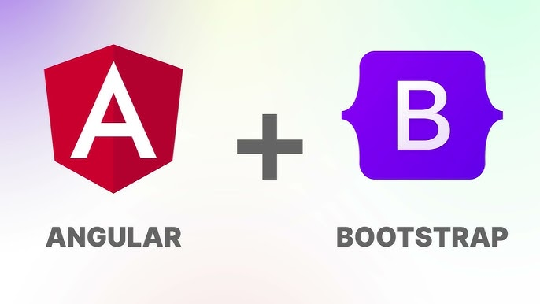

# Upload Demo using Angular

A JSON file is uploaded from an Angular application.

This project was generated with [Angular CLI](https://github.com/angular/angular-cli) version 14.2.13.

--------------------------------------------------------------------------------------------------------

## Rest API Backend

The Angular App uses a Spring Boot Rest API Backend that receives the uploaded file:

https://github.com/edgar-code-repository/spring-boot-upload-demo

-------------------------------------------------------------------------

## Simple file upload

## Upload Endpoint

--------------------------------------------------------------------------------------------------------
